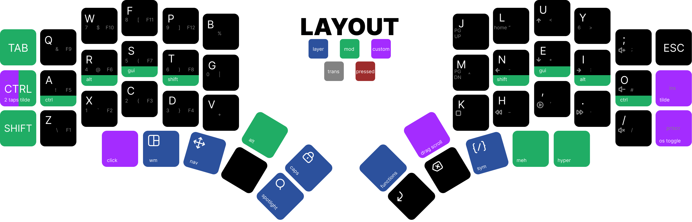
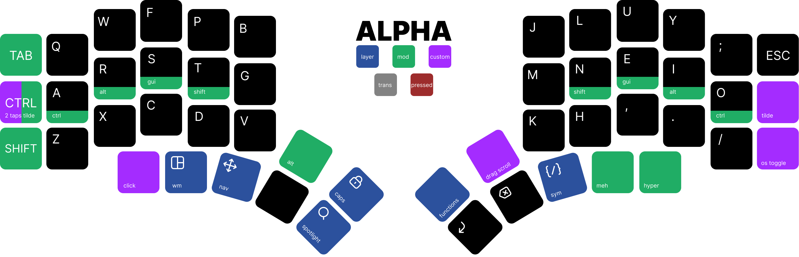
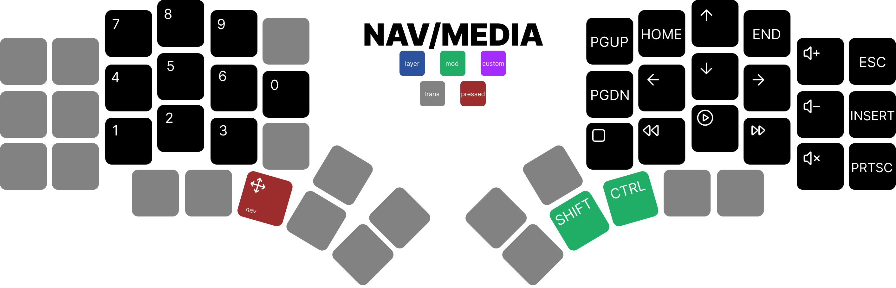
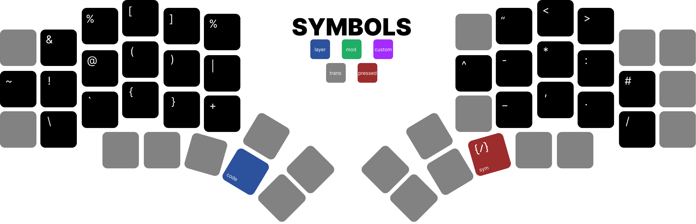
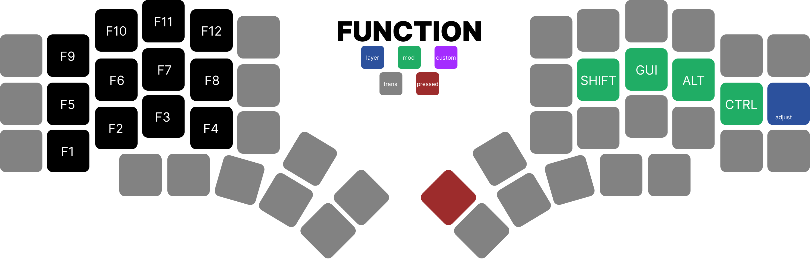
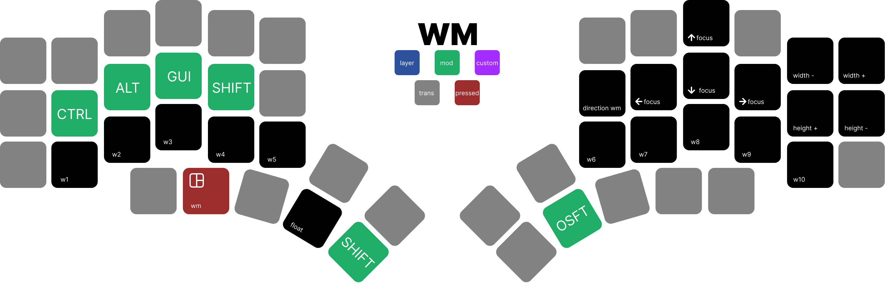
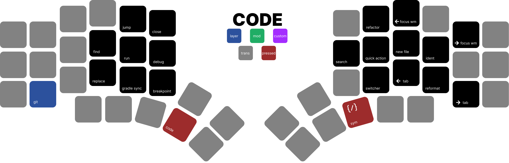
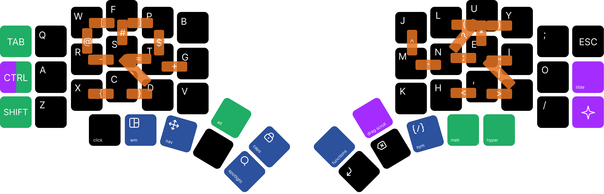

# Isaac's QMK Userspace

**Current information on how to compile and information regarding the halcyon modules are within the `halcyon` branch.**

> A keymap designed for productive development, efficient navigation, and custom shortcuts for environments like GlazeWM, IntelliJ IDEA, and Android Studio, with a modular and multi-layered approach.



## Requirements

This keymap uses advanced QMK features and requires the following tools to take full advantage of it:

- [QMK Firmware](https://github.com/qmk/qmk_firmware)
- [GlazeWM](https://github.com/glzr-io/glazewm) or [AeroSpace](https://github.com/nikitabobko/AeroSpace) – for tiling window management.

- [MacForAll plugin (JetBrains)](https://plugins.jetbrains.com/plugin/13968-macos-for-all) – allows using macOS style keybindings on Windows.
- [Backup and Sync (JetBrains)](https://plugins.jetbrains.com/plugin/20868-backup-and-sync) – to sync preferences and shortcuts.

---

## Current Compilation Commands

To compile each half of the keyboard with specific configurations:

```bash
# Left module with TFT display
qmk compile -kb splitkb/halcyon/kyria/rev4/isaacsa51 -e HLC_TFT_DISPLAY=1 -e TARGET=kyria_display

# Right module with Cirque trackpad
qmk compile -kb splitkb/halcyon/kyria/rev4/isaacsa51 -e HLC_CIRQUE_TRACKPAD=1 -e TARGET=kyria_trackpad
```

## Layers and Purpose

The keymap is organized into thematic layers with clear functional intent and context of use:

#### ALPHA (Base - Colemak DH)

Main layout.



- Mods in the middle row (ARST NEIO): Ctrl, Alt, GUI, Shift.
- Tap Dance: Caps Lock (1 tap) / Caps Lock (2 taps).
- Combinations (combos) for common symbols and operators.

#### CANARIA (Alternative)

- Variant based on Canaria Layout.
- A-C swapped for convenience.
- Same mod layout in the home row.

#### NAV (Navigation and Multimedia)

- Numbers, navigation keys (arrows, home/end), and media controls.
- One Shot and Tap Dance wildcards for Shift and Ctrl.

#### SYM (Symbols)

- Not all symbols are found in this layer, as several are easier to access via combo boxes.

#### FUNCTION (Functions)

- F1-F12 keys
- Access to the ADJUST layer.

#### WM (Window Manager)

- Shortcuts for managing windows in GlazeWM or AeroSpace.
- Moving between windows, changing layouts, and quickly accessing apps.
- Includes One Shot Shift to reduce simultaneous combinations.

#### CODE (Android / JetBrains IDEs)

- Designed for development with IntelliJ and Android Studio.

- Includes shortcuts such as:

1. RUN: Run project (Ctrl+Alt+R)

1. DEBUG: Start debugging (Ctrl+Alt+D)

1. QCKACT: Quick Action (Alt+Enter)

1. NEWFLE: New file/module

1. GLDSYN: Gradle sync (Ctrl+Shift+O)

1. BRKPNT: Breakpoints (Ctrl+F8)

1. Tab and window navigation (Ctrl+Shift+[, Ctrl+Alt+Shift+PgDn)

#### ADJUST (Adjustments and RGB)

- Change default layout (_ALPHA, _CANARIA).
- RGB lighting control: brightness, hue, saturation, effects.

#### GIT (One-Shot Layer - Git)
> [!WARNING]
> Currently this layer is on WIP
> Instant layer for Git actions: commit, push, rebase, stash, etc.
> Ideal for integrating into IntelliJ workflows.

## Combos

Combos optimization for frequent symbols, such as:

| Keys Involved | Result |
|--------------------------|-----------|
| S+T | `=` |
| N+U | `?` |
| W+F | `[` |
| F+P | `]` |
| R+S | `-` |
| X + C | `{` |
| C+D | `}` |
| T+G | `+` |
| W+R | `@` |
| S+D | `_` |
| L+U | `(` |
| U+Y | `)` |
| N+E | `:` |
| M + N | `|` |
| H+, | `<` |
| , + . | `>` |
| E+I | `"` |
| U + E | `*` |
| E + . | `\` |
| J + M | `^` |
| F + T | `!` |
| T + P | `$` |
| F + S | `#` |

## Philosophy

Modularity: Clear separation by context: navigation, symbols, macros, settings, windows, development.

Portability: Works on both macOS and Windows with system detection and contextual settings (TG_OS).

Efficiency: Home row mods, One Shot Layers, Combos, and well-utilized Thumb Cluster.

Dev/Productivity Focus: Entire layer for development shortcuts, tiling shortcuts, and quick moves.

## To Do
1. Migrate combos to a separate file.

2. Complete the _GIT layer.
