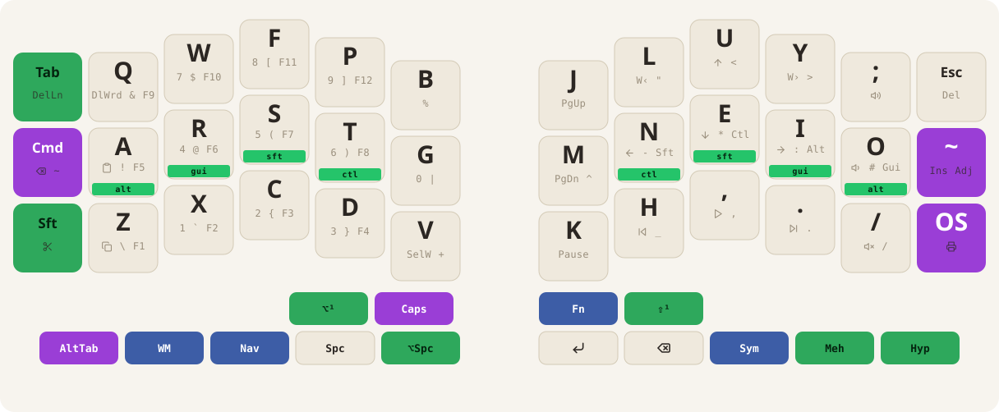

# isaacsa51 — Halcyon Kyria (rev4)

A split 3×6+5 columnar keymap — Colemak-DH base with a Spanish-tuned alternate,
home-row mods, an iconic symbol-combo layer, OS-aware editing that follows a
manual Win/Mac toggle, a FancyWM control layer, and PaletteFx RGB.



## Quick facts

- **Bases:** Colemak-DH · Crate (Spanish) · Canaria — swapped at runtime on the Adjust layer.
- **Home-row mods:** Alt · GUI · Shift · Ctrl, pinky→index, mirrored on both hands. Chordal Hold + `PERMISSIVE_HOLD`, 200 ms tapping term.
- **Combos:** fire by physical position, not layer, so the same gestures work on every base. 30 ms window (80 ms for the two 4-key WM-picker gestures).
- **OS-aware editing:** `TG_OS` flips Win ⇄ Mac for copy/cut/paste, word-move, delete-word, and more. The choice persists across replug/reboot.
- **RGB:** PaletteFx Reactive effect, Polarized palette, forced on every plug-in.
- **Mouse:** kinetic speed curve (`MK_KINETIC_SPEED`), ramps up the longer a direction is held.

## Full reference

- [KEYMAP.md](KEYMAP.md) — every layer, every combo, tap dances, and the OS-aware key table.
- [docs/index.html](docs/index.html) — the same reference as a local browsable site.
- [NOTES.md](NOTES.md) — build log, design decisions, and open TODOs.

## Build

```bash
# Left module with TFT display
qmk compile -kb splitkb/halcyon/kyria/rev4/isaacsa51 -e HLC_TFT_DISPLAY=1 -e TARGET=kyria_display

# Right module with Cirque trackpad
qmk compile -kb splitkb/halcyon/kyria/rev4/isaacsa51 -e HLC_CIRQUE_TRACKPAD=1 -e TARGET=kyria_trackpad
```
